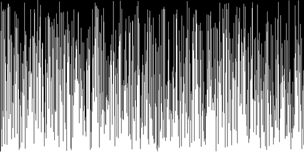

# Sorting Algorithms

# Algorithms

## Bubble Sort

**stable:** `Yes` - **time:** `O(n^2)` - **space:** `O(1)`

In bubble sort, iteration starts at the beginning of the array and swap the first two elements if the first is greater than the second. Then, it goes to the next pair of elements, and so on, continuously swapping the elements of the array until it's sorted.

**Pros**

The single best advantage of a bubble sort is that it's very simple to understand and easy to implement. Additionally, it's a stable sort algorithm that requires no additional memory, since all swaps are made in place.

**Cons**

Since it's `O(n^2)`, and hence it is very slow for large datasets.

**Real-Time Visualization of Bubble Sort**

## Insertion Sort

**stable:** `Yes` - **time:** `O(n^2)` - **space:** `O(1)`

The iteration starts from the beginning of array by consuming one input element each repetition and growing a sorted output list. At each iteration, insertion sort removes one element from the input data, finds the location it belongs within the sorted list and inserts it there. It repeats until no input elements remain.

**Pros**

It works very efficiently for lists that are nearly sorted initially. Furthermore, it can also work on data-sets that are constantly being added to.

**Cons**

Since it's `O(n^2)`, and hence it is very slow for large datasets.

**Real-Time Visualization of Insertion Sort**

## Selection Sort

**stable:** `No` - **time:** `O(n^2)` - **space:** `O(1)`

The iteration starts with the first element in the array and scans through the array to find the element with the smallest key, which it swaps with the first element. The process is then repeated with each subsequent element until the last element is reached.

**Pros**

It has the advantage that requires at most `n-1` swaps. In situations in which moving data elements is more expensive than comparing them, selection sort may perform better than other algorithms.

**Cons**

Since it's `O(n^2)`, and hence it is very slow for large datasets.

**Real-Time Visualization of Selection Sort**

## Quick Sort

**stable:** `No` - **time:** `O(n log n)` - **space:** `O(log n)`

Quicksort is a divide-and-conquer algorithm that involves choosing a pivot value from a data-set and splitting the set into two subsets: a set that contains all values less than the pivot and a set that contains all values greater than or equal to the pivot. The pivot/split process is recursively applied to each subset until there are no more subsets to split. The results are combined to form the final sorted set.

The challenge of quicksort is to determine a reasonable **pivot** element for dividing the data into two groups. The efficiency of the algorithm is entirely dependent upon how successfully an accurate the pivot value is selected. In the best case, the runtime is `O(n log n`). In the worst case where the array is presorted, the runtime drops to `O(n^2)`.

**Pros**

It doesn't require any additional storage. Hence it is suitable for large data sets.

**Cons**

The slight disadvantage of quicksort is that its worst-case performance is similar to average performances of the bubble, insertion or selections sorts.

**Real-Time Visualization of Quick Sort**

## MergeSort

**stable:** `No` - **time:** `O(n log n)` - **space:** `O(n)`

Merge sort is a divide-and-conquer algorithm that works by splitting a data set into two or more subsets, sorting the subsets, and then merging them together into the final sorted set.

Each recursively-call has `O(n)` runtime, and a total of `O(log n)` recursions are required, thus the runtime of this algorithm is `O(n log n)`.

**Pros**

Apart from being fairly efficient, a merge sort has the advantage that it can be used to solve other problems such as determining how **unsorted** a given list is.

**Cons**

It requires `O(n)` space complexity. Hence it loses an advantage when we are dealing with large data sets.

**Real-Time Visualization of Merge Sort**

## Heap Sort

**stable:** `No` - **time:** `O(n log n)` - **space:** `O(1)`

The first loop, the `O(n)` **max heapify** phase, puts the array into heap order. The second loop, the `O(n log n)` **heapify** phase, repeatedly extracts the maximum and restores heap order.

**Pros**

Heapsort is simple to implement, performs an `O(n log n)` in place sort, but is not stable. In the reversed case, the max heapify phase is as fast as possible since the array starts in heap order, but then the heapify phase is typical.

**Cons**

In the nearly sorted case, the heapify phase destroys the original order. In the few unique keys case, there is some speedup, but not as much as in 3-way quicksort.

**Real-Time Visualization of Heap Sort**

----

